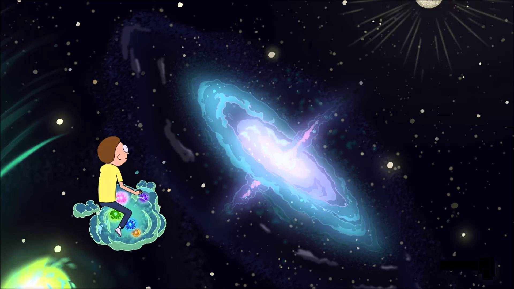

### Hi there 👋

I’m currently working on the [Cherenkov Telescope Array](https://www.cta-observatory.org/) 🔭 

More info on what I do: [vuillaut.github.io](https://vuillaut.github.io/)

<!--
**vuillaut/vuillaut** is a ✨ _special_ ✨ repository because its `README.md` (this file) appears on your GitHub profile.

Here are some ideas to get you started:

- 
- 🌱 I’m currently learning ...
- 👯 I’m looking to collaborate on ...
- 🤔 I’m looking for help with ...
- 💬 Ask me about ...
- 📫 How to reach me: vuillaut.github.io
- 😄 Pronouns: ...
- ⚡ Fun fact: ...

-->

